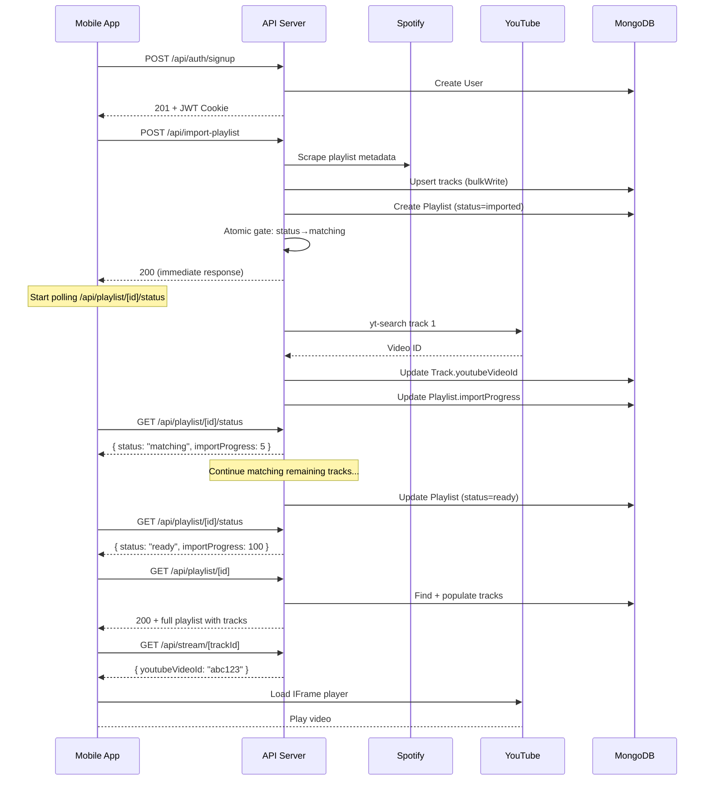
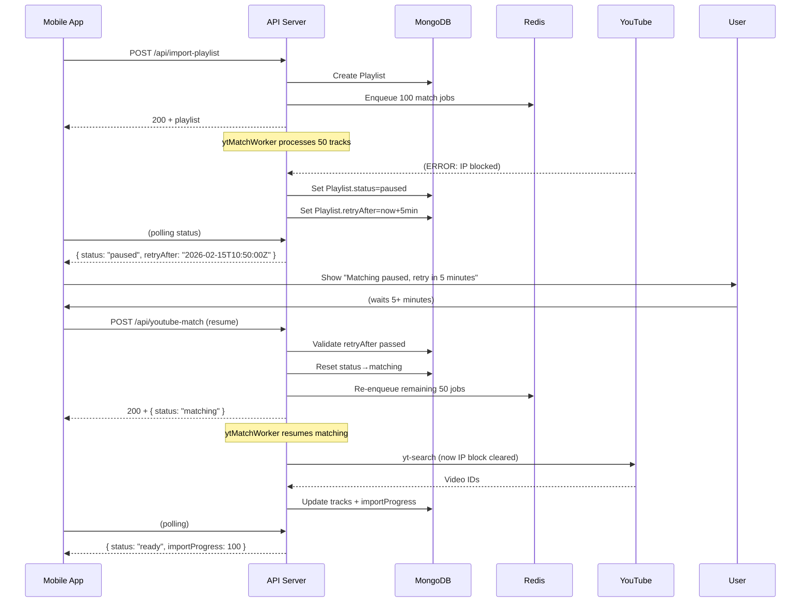

# Demus Music Streaming API Documentation

## Mobile Application Integration Guide

**Last Updated:** March 2026  
**API Version:** 1.0  
**Base URL:** `https://your-domain.com` (Production: `https://your-domain.com:4072`)

---

## Table of Contents

1. [Overview](#overview)
2. [Authentication](#authentication)
3. [Data Models](#data-models)
4. [Authentication Endpoints](#authentication-endpoints)
5. [Playlist Endpoints](#playlist-endpoints)
6. [Track Streaming](#track-streaming)
7. [Error Handling](#error-handling)
8. [Rate Limiting](#rate-limiting)
9. [Mobile Implementation Guide](#mobile-implementation-guide)
10. [Example Workflows](#example-workflows)

---

## Overview

Demus is a full-stack music streaming PWA featuring:

- **Spotify Integration**: Import playlists via public Spotify URLs (no API keys required)
- **YouTube Matching**: Automatic conversion of Spotify tracks to YouTube videos
- **Authenticated Playback**: JWT-based authentication with HTTP-only cookies
- **Offline Support**: Progressive Web App with service worker caching
- **Real-time Import Tracking**: WebSocket-ready polling endpoints for progress monitoring

### Key Features

- **Global Track Cache**: Tracks are shared across all users once matched to YouTube
- **Fire-and-Forget Processing**: Long-running YouTube match operations don't block API responses
- **Rate Limiting**: Protects auth and write endpoints with sliding-window limiters
- **Mobile-Optimized**: Lightweight endpoints for minimal bandwidth consumption

---

## Authentication

### JWT Cookie-Based Authentication

Demus uses **HTTP-only JWT cookies** for authentication. This approach provides:

- **Automatic CSRF protection** via SameSite=Lax cookies
- **XSS protection** through HTTP-only flag
- **Persistent sessions** across app restarts (7-day expiration)

#### How It Works

1. User signs up or logs in → receives JWT cookie
2. Cookie is automatically sent with every request (same-origin only)
3. Backend validates JWT and extracts `req.user._id`
4. On logout, client clears the cookie

#### Mobile Implementation

**For native mobile apps** (iOS/Android), since cookies are handled automatically by HTTP clients:

```swift
// Swift Example: Alamofire automatically handles cookies
let headers: HTTPHeaders = [
    "Content-Type": "application/json"
]

AF.request("https://music.kuldeepjadeja.dev/api/auth/me",
           headers: headers).response { response in
    // Cookie automatically included in request
    // Cookie automatically stored by HTTPCookieStorage.shared
}
```

```kotlin
// Kotlin Example: OkHttp automatically handles cookies
val client = OkHttpClient.Builder()
    .cookieJar(JavaCookieJar(CookieManager()))
    .build()

val request = Request.Builder()
    .url("https://music.kuldeepjadeja.dev/api/auth/me")
    .build()

// Cookie automatically included and stored
client.newCall(request).execute()
```

**For React Native / Web Views**:

```javascript
// JavaScript automatically includes cookies for same-origin requests
fetch("https://music.kuldeepjadeja.dev/api/auth/me", {
    credentials: "include", // Critical: include cookies
    method: "GET",
}).then((res) => res.json());
```

#### Token Refresh

The JWT cookie has a **7-day expiration**. After expiration:

- User receives a 401 response
- Client should redirect to login screen
- User logs in again to refresh the token

---

## Data Models

### User Model

```json
{
    "_id": "507f1f77bcf86cd799439011",
    "email": "user@example.com",
    "createdAt": "2026-01-15T10:30:00Z",
    "updatedAt": "2026-01-15T10:30:00Z"
}
```

| Field       | Type     | Description                      |
| ----------- | -------- | -------------------------------- |
| `_id`       | ObjectId | Unique user identifier           |
| `email`     | String   | Unique email address (lowercase) |
| `createdAt` | Date     | Account creation timestamp       |
| `updatedAt` | Date     | Last account modification        |

**Note:** `passwordHash` is never exposed in API responses.

### Track Model

```json
{
    "_id": "507f1f77bcf86cd799439012",
    "spotifyId": "2takcwgKJHFWWbcHxeNvST",
    "name": "Blinding Lights",
    "artists": ["The Weeknd"],
    "album": "After Hours",
    "duration": 200000,
    "youtubeVideoId": "4NRXx6U8ABQ",
    "albumImage": "https://i.scdn.co/image/cover.jpg",
    "importedAt": "2026-01-15T10:30:00Z"
}
```

| Field            | Type     | Description                           |
| ---------------- | -------- | ------------------------------------- |
| `_id`            | ObjectId | Unique track identifier               |
| `spotifyId`      | String   | Spotify track ID (unique, immutable)  |
| `name`           | String   | Track title                           |
| `artists`        | String[] | List of artist names                  |
| `album`          | String   | Album name                            |
| `duration`       | Number   | Duration in milliseconds              |
| `youtubeVideoId` | String   | YouTube video ID (null until matched) |
| `albumImage`     | String   | Album cover URL (3-tier enriched)     |
| `importedAt`     | Date     | When track entered the system         |

### Playlist Model

```json
{
    "_id": "507f1f77bcf86cd799439013",
    "user": "507f1f77bcf86cd799439011",
    "spotifyPlaylistId": "37i9dQZF1DZ52oBKHsb8RQ",
    "name": "Today's Top Hits",
    "description": "The hottest tracks right now",
    "coverImage": "https://mosaic.scdn.co/300/...",
    "owner": "Spotify",
    "trackCount": 50,
    "tracks": ["507f1f77bcf86cd799439012", "507f1f77bcf86cd799439014"],
    "status": "ready",
    "importProgress": 100,
    "createdAt": "2026-01-15T10:30:00Z"
}
```

| Field               | Type       | Description                                            |
| ------------------- | ---------- | ------------------------------------------------------ |
| `_id`               | ObjectId   | Unique playlist identifier                             |
| `user`              | ObjectId   | Owner user ID                                          |
| `spotifyPlaylistId` | String     | Spotify playlist ID                                    |
| `name`              | String     | Playlist name                                          |
| `description`       | String     | Playlist description                                   |
| `coverImage`        | String     | Playlist cover art URL                                 |
| `owner`             | String     | Spotify owner display name                             |
| `trackCount`        | Number     | Total number of tracks                                 |
| `tracks`            | ObjectId[] | Array of track IDs (populated on full fetch)           |
| `status`            | Enum       | See Status Values below                                |
| `importProgress`    | Number     | 0-100, percentage of tracks matched                    |
| `retryAfter`        | Date       | Minimum time before resume allowed (YouTube IP blocks) |
| `errorMessage`      | String     | Human-readable error description                       |

#### Playlist Status Values

| Status     | Meaning                                              | User Action                         |
| ---------- | ---------------------------------------------------- | ----------------------------------- |
| `imported` | Initial state; tracks saved but matching not started | Automatic transition to `matching`  |
| `matching` | Background YouTube matching in progress              | Wait or monitor via polling         |
| `ready`    | All tracks matched; fully playable                   | Fetch tracks and start playback     |
| `paused`   | Matching failed; `retryAfter` is set                 | Call resume endpoint after cooldown |
| `error`    | Unrecoverable failure; see `errorMessage`            | Manual retry or contact support     |

---

## Authentication Endpoints

### Sign Up

Creates a new user account and returns authenticated session.

**POST** `/api/auth/signup`

#### Request

```json
{
    "email": "user@example.com",
    "password": "securePassword123"
}
```

#### Request Headers

```
Content-Type: application/json
```

#### Response (201 Created)

```json
{
    "user": {
        "id": "507f1f77bcf86cd799439011",
        "email": "user@example.com"
    }
}
```

#### Response Headers

```
Set-Cookie: token=eyJhbGc...; HttpOnly; Secure; SameSite=Lax; Path=/; Max-Age=604800
```

#### Error Responses

| Status | Error                                       | Description                     |
| ------ | ------------------------------------------- | ------------------------------- |
| 400    | `Email and password are required`           | Missing email or password field |
| 400    | `Invalid email address`                     | Email format validation failed  |
| 400    | `Password must be at least 8 characters`    | Password too short              |
| 409    | `An account with this email already exists` | Email already registered        |
| 500    | `Internal server error`                     | Unexpected server error         |

#### Rate Limiting

- **Limit:** 5 attempts per IP per minute
- **Headers:** `X-RateLimit-Remaining: 4`, `X-RateLimit-Reset: 1234567890`

#### Mobile Implementation

```swift
// Swift Example
struct SignUpRequest: Codable {
    let email: String
    let password: String
}

func signUp(email: String, password: String) async throws -> User {
    let request = SignUpRequest(email: email, password: password)
    let data = try JSONEncoder().encode(request)

    var urlRequest = URLRequest(url: URL(string: "https://music.kuldeepjadeja.dev/api/auth/signup")!)
    urlRequest.httpMethod = "POST"
    urlRequest.setValue("application/json", forHTTPHeaderField: "Content-Type")
    urlRequest.httpBody = data
    urlRequest.httpShouldHandleCookies = true

    let (responseData, response) = try await URLSession.shared.data(for: urlRequest)

    guard let httpResponse = response as? HTTPURLResponse, httpResponse.statusCode == 201 else {
        throw SignUpError.failed
    }

    let result = try JSONDecoder().decode(SignUpResponse.self, from: responseData)
    return result.user
}
```

---

### Log In

Authenticates an existing user and returns an authenticated session.

**POST** `/api/auth/login`

#### Request

```json
{
    "email": "user@example.com",
    "password": "securePassword123"
}
```

#### Request Headers

```
Content-Type: application/json
```

#### Response (200 OK)

```json
{
    "user": {
        "id": "507f1f77bcf86cd799439011",
        "email": "user@example.com"
    }
}
```

#### Error Responses

| Status | Error                             | Description                     |
| ------ | --------------------------------- | ------------------------------- |
| 400    | `Email and password are required` | Missing email or password field |
| 401    | `Invalid email or password`       | Incorrect credentials           |
| 500    | `Internal server error`           | Unexpected server error         |

#### Rate Limiting

- **Limit:** 10 attempts per IP per minute
- **Headers:** `X-RateLimit-Remaining: 9`, `X-RateLimit-Reset: 1234567890`

---

### Log Out

Clears the authentication cookie and invalidates the session.

**POST** `/api/auth/logout`

#### Request

No body required.

#### Response (200 OK)

```json
{
    "ok": true
}
```

#### Response Headers

```
Set-Cookie: token=; HttpOnly; Secure; SameSite=Lax; Path=/; Max-Age=-1
```

#### Mobile Implementation (React Native)

```javascript
async function logout() {
    try {
        const response = await fetch(
            "https://music.kuldeepjadeja.dev/api/auth/logout",
            {
                method: "POST",
                credentials: "include", // Include cookies
                headers: {
                    "Content-Type": "application/json",
                },
            },
        );

        if (response.ok) {
            // Clear any local storage/cache
            await clearUserData();
            // Navigate to login screen
            navigation.navigate("Login");
        }
    } catch (error) {
        console.error("Logout failed:", error);
    }
}
```

---

### Get Current User

Returns the authenticated user or 401 if not logged in.

**GET** `/api/auth/me`

#### Request

No body required. Cookie automatically included.

#### Response (200 OK)

```json
{
    "user": {
        "id": "507f1f77bcf86cd799439011",
        "email": "user@example.com"
    }
}
```

#### Error Responses

| Status | Error                   | Description                 |
| ------ | ----------------------- | --------------------------- |
| 401    | `Not authenticated`     | No valid JWT cookie present |
| 500    | `Internal server error` | Unexpected server error     |

#### Use Cases

- **Initial app load**: Check if user has existing session
- **Session validation**: Verify session is still valid before critical operations
- **Profile display**: Fetch current user info on profile screen

#### Mobile Implementation

```kotlin
// Kotlin Example: Check if user is authenticated on app startup
suspend fun checkAuth(): Result<User> = withContext(Dispatchers.IO) {
    try {
        val response = httpClient.get("https://music.kuldeepjadeja.dev/api/auth/me") {
            header("Content-Type", "application/json")
        }

        if (response.status == HttpStatusCode.OK) {
            val user = response.body<User>()
            Result.success(user)
        } else {
            Result.failure(Exception("Not authenticated"))
        }
    } catch (e: Exception) {
        Result.failure(e)
    }
}
```

---

## Playlist Endpoints

### Get All Playlists

Retrieves a lightweight list of all playlists owned by the authenticated user.

**GET** `/api/playlists`

#### Authentication

**Required** - JWT cookie must be valid

#### Response (200 OK)

```json
{
    "playlists": [
        {
            "_id": "507f1f77bcf86cd799439013",
            "name": "Today's Top Hits",
            "status": "ready",
            "importProgress": 100,
            "spotifyPlaylistId": "37i9dQZF1DZ52oBKHsb8RQ",
            "coverImage": "https://mosaic.scdn.co/300/..."
        },
        {
            "_id": "507f1f77bcf86cd799439014",
            "name": "Chill Vibes",
            "status": "matching",
            "importProgress": 65,
            "spotifyPlaylistId": "37i9dQZEL0s0...",
            "coverImage": "https://mosaic.scdn.co/300/..."
        }
    ]
}
```

#### Response Details

- **Sorting**: Descending by creation date (newest first)
- **Fields**: Only essential fields returned (no track population)
- **Performance**: Lightweight query suitable for frequent polling

#### Error Responses

| Status | Error                       | Description                   |
| ------ | --------------------------- | ----------------------------- |
| 401    | `Not authenticated`         | Invalid or missing JWT cookie |
| 500    | `Failed to fetch playlists` | Unexpected server error       |

#### Caching Recommendations

For mobile apps, cache this response with TTL of 30-60 seconds:

```swift
// Swift: Cache implementation
class PlaylistCache {
    private var cachedPlaylists: [Playlist]?
    private var cacheTimestamp: Date?
    private let cacheDuration: TimeInterval = 30 // 30 seconds

    func getPlaylists(forceRefresh: Bool = false) async throws -> [Playlist] {
        let now = Date()

        if !forceRefresh,
           let cached = cachedPlaylists,
           let timestamp = cacheTimestamp,
           now.timeIntervalSince(timestamp) < cacheDuration {
            return cached
        }

        let playlists = try await fetchPlaylistsFromAPI()
        cachedPlaylists = playlists
        cacheTimestamp = now
        return playlists
    }
}
```

---

### Import Playlist

Initiates the full import pipeline: scrape Spotify metadata, save tracks to DB, queue YouTube matching.

**POST** `/api/import-playlist`

#### Authentication

**Required** - JWT cookie must be valid

#### Request

```json
{
    "url": "https://open.spotify.com/playlist/37i9dQZF1DZ52oBKHsb8RQ"
}
```

#### Request Headers

```
Content-Type: application/json
```

#### Response (200 OK)

```json
{
    "success": true,
    "playlist": {
        "id": "507f1f77bcf86cd799439013",
        "name": "Today's Top Hits",
        "trackCount": 50,
        "status": "imported",
        "coverImage": "https://mosaic.scdn.co/300/...",
        "uncachedTracks": 45
    }
}
```

#### Response Details

- **`status`**: Initial import status (may be `"imported"` if all tracks cached, or `"ready"` if fully matched)
- **`uncachedTracks`**: Number of tracks queued for YouTube matching (background process)
- **`trackCount`**: Total tracks in playlist
- **Immediate response**: Always returns before YouTube matching begins (fire-and-forget)

#### Background Processing

After the HTTP response, the server:

1. Pushes YouTube match jobs to Redis queue
2. `ytMatchWorker` process consumes jobs sequentially (max 1 yt-search at a time)
3. Updates `Track.youtubeVideoId` as matches complete
4. Updates `Playlist.importProgress` (0-100) every 10 tracks
5. Updates `Playlist.status` → `"ready"` when all tracks matched

**Important:** The API response returns immediately; matching happens asynchronously.

#### Error Responses

| Status | Error                           | Description                                  |
| ------ | ------------------------------- | -------------------------------------------- |
| 400    | `Missing "url" in request body` | No URL provided                              |
| 400    | `Invalid Spotify playlist URL`  | URL format incorrect or not a valid playlist |
| 401    | `Not authenticated`             | Invalid or missing JWT cookie                |
| 409    | `Playlist already imported`     | Same user + playlist combination exists      |
| 500    | `Failed to import playlist`     | Spotify scrape or DB error                   |

#### Rate Limiting

- **Limit:** 10 imports per IP per minute
- **Headers:** `X-RateLimit-Remaining: 9`, `X-RateLimit-Reset: 1234567890`

#### Supported Spotify URL Formats

```
✅ https://open.spotify.com/playlist/37i9dQZF1DZ52oBKHsb8RQ
✅ https://open.spotify.com/playlist/37i9dQZF1DZ52oBKHsb8RQ?si=...
✅ spotify:playlist:37i9dQZF1DZ52oBKHsb8RQ
```

#### Mobile Implementation - Import & Progress Tracking

```swift
// Swift Example: Import playlist and poll status until ready
@MainActor
class PlaylistImportManager: NSObject, ObservableObject {
    @Published var importProgress = 0
    @Published var importStatus: PlaylistStatus = .imported
    private var pollTimer: Timer?

    func importPlaylist(url: String) async throws -> Playlist {
        let request = ImportPlaylistRequest(url: url)
        let data = try JSONEncoder().encode(request)

        var urlRequest = URLRequest(url: URL(string: "https://music.kuldeepjadeja.dev/api/import-playlist")!)
        urlRequest.httpMethod = "POST"
        urlRequest.setValue("application/json", forHTTPHeaderField: "Content-Type")
        urlRequest.httpBody = data
        urlRequest.httpShouldHandleCookies = true

        let (responseData, response) = try await URLSession.shared.data(for: urlRequest)

        guard let httpResponse = response as? HTTPURLResponse, httpResponse.statusCode == 200 else {
            throw ImportError.failed
        }

        let result = try JSONDecoder().decode(ImportPlaylistResponse.self, from: responseData)
        let playlist = result.playlist

        // Start polling status
        await startPollingStatus(playlistId: playlist.id)

        return playlist
    }

    private func startPollingStatus(playlistId: String) async {
        // Poll every 1.5 seconds until status is "ready" or "error"
        var isComplete = false

        while !isComplete {
            do {
                let status = try await fetchPlaylistStatus(playlistId: playlistId)

                DispatchQueue.main.async {
                    self.importStatus = status.status
                    self.importProgress = status.importProgress
                }

                if status.status == .ready || status.status == .error || status.status == .paused {
                    isComplete = true
                }

                // Wait 1.5 seconds before next poll
                try await Task.sleep(nanoseconds: 1_500_000_000)
            } catch {
                print("Failed to fetch status: \(error)")
                isComplete = true
            }
        }
    }

    private func fetchPlaylistStatus(playlistId: String) async throws -> PlaylistStatusResponse {
        var urlRequest = URLRequest(url: URL(string: "https://music.kuldeepjadeja.dev/api/playlist/\(playlistId)/status")!)
        urlRequest.httpMethod = "GET"
        urlRequest.httpShouldHandleCookies = true

        let (responseData, response) = try await URLSession.shared.data(for: urlRequest)

        guard let httpResponse = response as? HTTPURLResponse, (200...299).contains(httpResponse.statusCode) else {
            throw ImportError.statusCheckFailed
        }

        return try JSONDecoder().decode(PlaylistStatusResponse.self, from: responseData)
    }
}
```

---

### Get Playlist (with Tracks)

Retrieves a complete playlist with all populated track data. **Use only after status is "ready"**.

**GET** `/api/playlist/[id]`

#### Authentication

**Required** - JWT cookie must be valid (user must own the playlist)

#### Path Parameters

| Parameter | Type              | Description |
| --------- | ----------------- | ----------- |
| `id`      | String (ObjectId) | Playlist ID |

#### Response (200 OK)

```json
{
    "id": "507f1f77bcf86cd799439013",
    "name": "Today's Top Hits",
    "description": "The hottest tracks right now",
    "coverImage": "https://mosaic.scdn.co/300/...",
    "owner": "Spotify",
    "status": "ready",
    "importProgress": 100,
    "trackCount": 50,
    "tracks": [
        {
            "id": "507f1f77bcf86cd799439012",
            "name": "Blinding Lights",
            "artists": ["The Weeknd"],
            "album": "After Hours",
            "duration": 200000,
            "spotifyId": "2takcwgKJHFWWbcHxeNvST",
            "youtubeVideoId": "4NRXx6U8ABQ",
            "albumImage": "https://i.scdn.co/image/cover.jpg"
        },
        {
            "id": "507f1f77bcf86cd799439014",
            "name": "Levitating",
            "artists": ["Dua Lipa", "DaBaby"],
            "album": "Future Nostalgia (The Moonlight Edition)",
            "duration": 203960,
            "spotifyId": "3takcwgKJHFWWbcHxeNvST",
            "youtubeVideoId": "TUVcZfQe-Kw",
            "albumImage": "https://i.scdn.co/image/cover2.jpg"
        }
    ]
}
```

#### Error Responses

| Status | Error                      | Description                                   |
| ------ | -------------------------- | --------------------------------------------- |
| 400    | `Invalid playlist ID`      | ID is not a valid MongoDB ObjectId            |
| 401    | `Not authenticated`        | Invalid or missing JWT cookie                 |
| 404    | `Playlist not found`       | Playlist doesn't exist or user doesn't own it |
| 500    | `Failed to fetch playlist` | Unexpected server error                       |

#### Performance Notes

- **Payload Size**: Can be 50KB+ for large playlists (100+ tracks)
- **Database Hits**: Single query with `.populate('tracks')` join
- **Caching**: Safe to cache locally for 5-10 minutes per playlist
- **Bandwidth**: Use on WiFi when possible; consider pagination for very large playlists (future feature)

#### Mobile Implementation - Efficient Track Display

```javascript
// React Native Example: Load tracks with caching and lazy rendering
import { useCallback, useEffect, useState } from "react";
import { FlatList, View, Text } from "react-native";

export function PlaylistScreen({ playlistId }) {
    const [tracks, setTracks] = useState([]);
    const [isLoading, setIsLoading] = useState(true);
    const [error, setError] = useState(null);

    useEffect(() => {
        loadPlaylist();
    }, [playlistId]);

    const loadPlaylist = useCallback(async () => {
        try {
            setIsLoading(true);
            const response = await fetch(
                `https://music.kuldeepjadeja.dev/api/playlist/${playlistId}`,
                {
                    credentials: "include",
                    headers: { "Content-Type": "application/json" },
                },
            );

            if (!response.ok) throw new Error("Failed to fetch");

            const data = await response.json();
            setTracks(data.tracks);
        } catch (err) {
            setError(err.message);
        } finally {
            setIsLoading(false);
        }
    }, [playlistId]);

    const renderTrack = ({ item }) => (
        <View style={styles.trackRow}>
            <Image source={{ uri: item.albumImage }} style={styles.thumbnail} />
            <View style={styles.trackInfo}>
                <Text style={styles.trackName}>{item.name}</Text>
                <Text style={styles.artists}>{item.artists.join(", ")}</Text>
                <Text style={styles.duration}>
                    {millisToMinuteSecond(item.duration)}
                </Text>
            </View>
        </View>
    );

    return (
        <FlatList
            data={tracks}
            keyExtractor={(item) => item.id}
            renderItem={renderTrack}
            onEndReachedThreshold={0.5}
            initialNumToRender={10} // Lazy render for performance
            maxToRenderPerBatch={20}
            updateCellsBatchingPeriod={50}
            removeClippedSubviews={true}
        />
    );
}
```

---

### Get Playlist Status (Lightweight Polling)

Returns only the status and import progress; optimized for polling during import.

**GET** `/api/playlist/[id]/status`

#### Authentication

**Required** - JWT cookie must be valid

#### Path Parameters

| Parameter | Type              | Description |
| --------- | ----------------- | ----------- |
| `id`      | String (ObjectId) | Playlist ID |

#### Response (200 OK)

```json
{
    "status": "matching",
    "importProgress": 65
}
```

#### Response Details

- **Minimal payload**: Only 2 fields, typically <100 bytes
- **Database query**: `.select('status importProgress').lean()` — extreme efficiency
- **Purpose**: Designed for aggressive polling (every 1-3 seconds during import)

#### Error Responses

| Status | Error                    | Description                          |
| ------ | ------------------------ | ------------------------------------ |
| 400    | `Invalid playlist ID`    | ID format is invalid                 |
| 401    | `Not authenticated`      | Invalid or missing JWT cookie        |
| 404    | `Playlist not found`     | Doesn't exist or user doesn't own it |
| 500    | `Failed to fetch status` | Unexpected server error              |

#### Polling Strategy

For mobile apps, implement an exponential backoff when fetching playlist status:

```kotlin
// Kotlin Example: Intelligent polling with backoff
@HiltViewModel
class ImportProgressViewModel @Inject constructor(
    private val apiService: ApiService
) : ViewModel() {

    private var pollJob: Job? = null

    fun startPolling(playlistId: String) {
        pollJob?.cancel()
        pollJob = viewModelScope.launch {
            var delayMs = 1500L // Start at 1.5 seconds
            val maxDelayMs = 5000L // Cap at 5 seconds

            while (isActive) {
                try {
                    val status = apiService.getPlaylistStatus(playlistId)
                    updateUI(status)

                    if (status.status == "ready" || status.status == "error" || status.status == "paused") {
                        // Stop polling when complete
                        cancel()
                    }

                    delay(delayMs)
                    delayMs = minOf(delayMs * 2, maxDelayMs) // Exponential backoff
                } catch (e: Exception) {
                    Log.e("ImportProgress", "Poll failed", e)
                    delay(delayMs)
                }
            }
        }
    }

    fun stopPolling() {
        pollJob?.cancel()
    }
}
```

---

## Track Streaming

### Get Track Stream URL

Returns the YouTube video ID and embed URL for direct playback.

**GET** `/api/stream/[trackId]`

#### Authentication

**Not required** - Public endpoint

#### Path Parameters

| Parameter | Type              | Description |
| --------- | ----------------- | ----------- |
| `trackId` | String (ObjectId) | Track ID    |

#### Response (200 OK)

```json
{
    "trackId": "507f1f77bcf86cd799439012",
    "youtubeVideoId": "4NRXx6U8ABQ",
    "embedUrl": "https://www.youtube.com/embed/4NRXx6U8ABQ",
    "noCookie": true
}
```

#### Response Details

- **`youtubeVideoId`**: YouTube video ID for IFrame API playback
- **`embedUrl`**: Direct YouTube embed URL (alternative format)
- **`noCookie`**: Use privacy-enhanced YouTube embed (`youtube-nocookie.com`)
- **Caching**: Response is cached for 6 hours in Redis

#### Error Responses

| Status | Error                    | Description                                   |
| ------ | ------------------------ | --------------------------------------------- |
| 404    | `Track not found`        | Track ID doesn't exist                        |
| 404    | `Track not matched`      | Track exists but no YouTube video ID assigned |
| 500    | `Failed to fetch stream` | Unexpected server error                       |

#### Implementation Notes

- **IFrame Players**: Use `youtubeVideoId` directly with YouTube IFrame API
- **WebView Players**: Can use `embedUrl` for embedded playback
- **No Audio Streaming**: The API does NOT proxy audio; all playback is through YouTube

---

## Error Handling

### Standard Error Response Format

All error responses follow this format:

```json
{
    "error": "Error message describing the issue",
    "code": "ERROR_CODE",
    "details": {
        "field": "Additional context if applicable"
    }
}
```

### HTTP Status Codes

| Status | Meaning               | Common Cause                                           |
| ------ | --------------------- | ------------------------------------------------------ |
| 200    | OK                    | Request succeeded                                      |
| 201    | Created               | New resource created (signup/import)                   |
| 400    | Bad Request           | Invalid input; malformed JSON; missing required fields |
| 401    | Unauthorized          | Missing or invalid JWT cookie; session expired         |
| 404    | Not Found             | Resource doesn't exist; wrong playlist/track ID        |
| 405    | Method Not Allowed    | Wrong HTTP method (POST vs GET, etc.)                  |
| 409    | Conflict              | Resource already exists (duplicate email signup)       |
| 429    | Too Many Requests     | Rate limit exceeded                                    |
| 500    | Internal Server Error | Unexpected server-side error                           |

### Common Error Scenarios

#### Expired Session (JWT Timeout)

**Error Response**:

```json
{
    "error": "Not authenticated",
    "code": "AUTH_EXPIRED"
}
```

**Mobile Handling**:

```swift
if response.statusCode == 401 {
    // Clear cached user data
    UserDefaults.standard.removeObject(forKey: "user")
    // Redirect to login
    navigate(to: LoginViewController())
}
```

#### Rate Limit Exceeded

**Error Response**:

```json
{
    "error": "Too many requests",
    "code": "RATE_LIMITED",
    "details": {
        "retryAfter": 45
    }
}
```

**Response Headers**:

```
X-RateLimit-Limit: 10
X-RateLimit-Remaining: 0
X-RateLimit-Reset: 1645023456
Retry-After: 45
```

**Mobile Handling**:

```swift
if response.statusCode == 429 {
    if let retryAfter = response.value(forHTTPHeaderField: "Retry-After") {
        let seconds = Int(retryAfter) ?? 60
        showToast("Please try again in \(seconds) seconds")
        disableSignupButton(for: seconds)
    }
}
```

#### Network Error with Retry Logic

```javascript
// React Native: Exponential backoff retry
async function fetchWithRetry(url, options, maxRetries = 3) {
    let lastError;

    for (let attempt = 1; attempt <= maxRetries; attempt++) {
        try {
            const response = await fetch(url, options);

            if (response.ok) {
                return response;
            }

            // Don't retry client errors (4xx)
            if (response.status >= 400 && response.status < 500) {
                throw new Error(`Client error: ${response.status}`);
            }

            throw new Error(`Server error: ${response.status}`);
        } catch (error) {
            lastError = error;

            if (attempt < maxRetries) {
                const delayMs = Math.pow(2, attempt) * 1000;
                await new Promise((resolve) => setTimeout(resolve, delayMs));
            }
        }
    }

    throw lastError;
}
```

---

## Rate Limiting

### Overview

Rate limiting protects endpoints from abuse and overload. The API uses **sliding-window rate limiting** on a per-IP basis.

### Rate Limits by Endpoint

| Endpoint                        | Limit     | Window   |
| ------------------------------- | --------- | -------- |
| `POST /api/auth/signup`         | 5         | 1 minute |
| `POST /api/auth/login`          | 10        | 1 minute |
| `POST /api/auth/logout`         | Unlimited | —        |
| `GET /api/auth/me`              | Unlimited | —        |
| `POST /api/import-playlist`     | 10        | 1 minute |
| `GET /api/playlists`            | Unlimited | —        |
| `GET /api/playlist/[id]`        | Unlimited | —        |
| `GET /api/playlist/[id]/status` | Unlimited | —        |
| `GET /api/stream/[trackId]`     | Unlimited | —        |

### Rate Limit Headers

Every response includes these headers:

```
X-RateLimit-Limit: 10
X-RateLimit-Remaining: 9
X-RateLimit-Reset: 1645023400
```

| Header                  | Meaning                           |
| ----------------------- | --------------------------------- |
| `X-RateLimit-Limit`     | Total requests allowed in window  |
| `X-RateLimit-Remaining` | Requests remaining before limit   |
| `X-RateLimit-Reset`     | Unix timestamp when window resets |

### When Rate Limited (429 Response)

```json
{
    "error": "Too many requests",
    "code": "RATE_LIMITED",
    "details": {
        "limit": 10,
        "remaining": 0,
        "resetAt": "2026-02-15T10:35:00Z"
    }
}
```

**Response Headers**:

```
Retry-After: 45
X-RateLimit-Reset: 1645023500
```

### Client-Side Rate Limit Prevention

```swift
// Swift: Local rate limit tracking before making requests
class RateLimitTracker {
    private var limits: [String: RateLimitState] = [:]

    func canRequest(endpoint: String) -> Bool {
        if let state = limits[endpoint] {
            let now = Date()
            if now < state.resetTime {
                return state.remaining > 0
            }
        }
        return true
    }

    func updateFromResponse(_ response: HTTPURLResponse, endpoint: String) {
        let remaining = Int(response.value(forHTTPHeaderField: "X-RateLimit-Remaining") ?? "0") ?? 0
        let resetTimestamp = Int(response.value(forHTTPHeaderField: "X-RateLimit-Reset") ?? "0") ?? 0

        limits[endpoint] = RateLimitState(
            remaining: remaining,
            resetTime: Date(timeIntervalSince1970: TimeInterval(resetTimestamp))
        )
    }
}
```

---

## Mobile Implementation Guide

### iOS Implementation (Swift)

#### 1. Setup: Network Configuration

```swift
import Foundation

class APIClient {
    static let shared = APIClient()

    let baseURL = URL(string: "https://music.kuldeepjadeja.dev")!
    let session: URLSession

    init() {
        var config = URLSessionConfiguration.default
        config.waitsForConnectivity = true
        config.httpCookieAcceptPolicy = .always
        config.httpShouldSetCookies = true
        config.httpCookieStorage = HTTPCookieStorage.shared

        self.session = URLSession(configuration: config)
    }

    private func makeRequest(
        endpoint: String,
        method: String = "GET",
        body: Encodable? = nil
    ) async throws -> (Data, HTTPURLResponse) {
        var url = baseURL.appendingPathComponent(endpoint)
        var request = URLRequest(url: url)
        request.httpMethod = method
        request.setCommonHeaders()

        if let body = body {
            request.httpBody = try JSONEncoder().encode(body)
        }

        let (data, response) = try await session.data(for: request)

        guard let httpResponse = response as? HTTPURLResponse else {
            throw APIError.invalidResponse
        }

        return (data, httpResponse)
    }
}

extension URLRequest {
    mutating func setCommonHeaders() {
        setValue("application/json", forHTTPHeaderField: "Content-Type")
        setValue("2.0", forHTTPHeaderField: "Accept")
    }
}
```

#### 2. Authentication Flow

```swift
@MainActor
class AuthManager: NSObject, ObservableObject {
    @Published var isAuthenticated = false
    @Published var user: User?
    @Published var error: String?

    private let apiClient = APIClient.shared

    override init() {
        super.init()
        checkAuthentication()
    }

    func checkAuthentication() {
        Task {
            do {
                let (data, response) = try await apiClient.makeRequest(endpoint: "api/auth/me")

                if response.statusCode == 200 {
                    let result = try JSONDecoder().decode(UserResponse.self, from: data)
                    self.user = result.user
                    self.isAuthenticated = true
                } else {
                    self.isAuthenticated = false
                }
            } catch {
                self.isAuthenticated = false
            }
        }
    }

    func signup(email: String, password: String) async throws {
        let request = SignUpRequest(email: email, password: password)
        let (data, response) = try await apiClient.makeRequest(
            endpoint: "api/auth/signup",
            method: "POST",
            body: request
        )

        if response.statusCode != 201 {
            throw APIError.requestFailed(status: response.statusCode)
        }

        let result = try JSONDecoder().decode(UserResponse.self, from: data)
        self.user = result.user
        self.isAuthenticated = true
    }

    func login(email: String, password: String) async throws {
        let request = LoginRequest(email: email, password: password)
        let (data, response) = try await apiClient.makeRequest(
            endpoint: "api/auth/login",
            method: "POST",
            body: request
        )

        if response.statusCode != 200 {
            throw APIError.requestFailed(status: response.statusCode)
        }

        let result = try JSONDecoder().decode(UserResponse.self, from: data)
        self.user = result.user
        self.isAuthenticated = true
    }

    func logout() async throws {
        _ = try await apiClient.makeRequest(
            endpoint: "api/auth/logout",
            method: "POST"
        )

        self.user = nil
        self.isAuthenticated = false
    }
}
```

#### 3. Playlist Management

```swift
@MainActor
class PlaylistManager: NSObject, ObservableObject {
    @Published var playlists: [Playlist] = []
    @Published var isLoading = false
    @Published var error: String?

    private let apiClient = APIClient.shared
    private var pollTimer: Timer?

    func fetchPlaylists() {
        Task {
            isLoading = true
            do {
                let (data, _) = try await apiClient.makeRequest(endpoint: "api/playlists")
                let response = try JSONDecoder().decode(PlaylistsResponse.self, from: data)
                self.playlists = response.playlists
            } catch {
                self.error = error.localizedDescription
            }
            isLoading = false
        }
    }

    func importPlaylist(url: String) async throws -> Playlist {
        let request = ImportRequest(url: url)
        let (data, _) = try await apiClient.makeRequest(
            endpoint: "api/import-playlist",
            method: "POST",
            body: request
        )

        let response = try JSONDecoder().decode(ImportResponse.self, from: data)

        // Add to playlists and start polling
        self.playlists.insert(response.playlist, at: 0)
        startPollingPlaylist(response.playlist.id)

        return response.playlist
    }

    private func startPollingPlaylist(_ playlistId: String) {
        var pollCount = 0
        let maxPolls = 120 // Max 3 minutes of polling (1.5s × 120)

        pollTimer = Timer.scheduledTimer(withTimeInterval: 1.5, repeats: true) { [weak self] timer in
            pollCount += 1

            guard pollCount < maxPolls else {
                timer.invalidate()
                return
            }

            Task {
                do {
                    let (data, _) = try await self?.apiClient.makeRequest(
                        endpoint: "api/playlist/\(playlistId)/status"
                    ) ?? (Data(), URLResponse())

                    let status = try JSONDecoder().decode(PlaylistStatus.self, from: data)

                    await MainActor.run {
                        if let index = self?.playlists.firstIndex(where: { $0.id == playlistId }) {
                            self?.playlists[index].status = status.status
                            self?.playlists[index].importProgress = status.importProgress
                        }
                    }

                    if status.status == "ready" || status.status == "error" {
                        timer.invalidate()
                    }
                } catch {
                    print("Poll error: \(error)")
                }
            }
        }
    }
}
```

### Android Implementation (Kotlin)

#### 1. Setup: Retrofit Configuration

```kotlin
import retrofit2.Retrofit
import retrofit2.converter.moshi.MoshiConverterFactory
import okhttp3.OkHttpClient
import okhttp3.logging.HttpLoggingInterceptor
import java.net.CookieManager
import java.net.CookiePolicy

object ApiClient {
    private const val BASE_URL = "https://music.kuldeepjadeja.dev/"

    val instance: ApiService by lazy {
        val cookieManager = CookieManager().apply {
            setCookiePolicy(CookiePolicy.ACCEPT_ALL)
        }

        val logging = HttpLoggingInterceptor().apply {
            level = HttpLoggingInterceptor.Level.BODY
        }

        val client = OkHttpClient.Builder()
            .cookieJar(JavaCookieJar(cookieManager))
            .addInterceptor(logging)
            .build()

        Retrofit.Builder()
            .baseUrl(BASE_URL)
            .client(client)
            .addConverterFactory(MoshiConverterFactory.create())
            .build()
            .create(ApiService::class.java)
    }
}

interface ApiService {
    @POST("api/auth/signup")
    suspend fun signup(@Body request: SignUpRequest): UserResponse

    @POST("api/auth/login")
    suspend fun login(@Body request: LoginRequest): UserResponse

    @POST("api/auth/logout")
    suspend fun logout()

    @GET("api/auth/me")
    suspend fun getCurrentUser(): UserResponse

    @GET("api/playlists")
    suspend fun getPlaylists(): PlaylistsResponse

    @POST("api/import-playlist")
    suspend fun importPlaylist(@Body request: ImportRequest): ImportResponse

    @GET("api/playlist/{id}")
    suspend fun getPlaylist(@Path("id") id: String): PlaylistResponse

    @GET("api/playlist/{id}/status")
    suspend fun getPlaylistStatus(@Path("id") id: String): PlaylistStatusResponse

    @GET("api/stream/{trackId}")
    suspend fun getTrackStream(@Path("trackId") id: String): StreamResponse
}
```

#### 2. Authentication ViewModel

```kotlin
@HiltViewModel
class AuthViewModel @Inject constructor(
    private val apiService: ApiService
) : ViewModel() {

    private val _authState = MutableStateFlow<AuthState>(AuthState.Idle)
    val authState = _authState.asStateFlow()

    fun signup(email: String, password: String) {
        viewModelScope.launch {
            _authState.emit(AuthState.Loading)
            try {
                val response = apiService.signup(SignUpRequest(email, password))
                _authState.emit(AuthState.Authenticated(response.user))
            } catch (e: Exception) {
                _authState.emit(AuthState.Error(e.message ?: "Signup failed"))
            }
        }
    }

    fun login(email: String, password: String) {
        viewModelScope.launch {
            _authState.emit(AuthState.Loading)
            try {
                val response = apiService.login(LoginRequest(email, password))
                _authState.emit(AuthState.Authenticated(response.user))
            } catch (e: Exception) {
                _authState.emit(AuthState.Error(e.message ?: "Login failed"))
            }
        }
    }

    fun logout() {
        viewModelScope.launch {
            try {
                apiService.logout()
                _authState.emit(AuthState.Unauthenticated)
            } catch (e: Exception) {
                _authState.emit(AuthState.Error(e.message ?: "Logout failed"))
            }
        }
    }

    fun checkAuth() {
        viewModelScope.launch {
            try {
                val response = apiService.getCurrentUser()
                _authState.emit(AuthState.Authenticated(response.user))
            } catch (e: Exception) {
                _authState.emit(AuthState.Unauthenticated)
            }
        }
    }
}

sealed class AuthState {
    data object Idle : AuthState()
    data object Loading : AuthState()
    data class Authenticated(val user: User) : AuthState()
    data object Unauthenticated : AuthState()
    data class Error(val message: String) : AuthState()
}
```

### React Native Implementation (JavaScript)

#### 1. Auth Context

```javascript
import React, { createContext, useState, useCallback, useEffect } from "react";

export const AuthContext = createContext();

export function AuthProvider({ children }) {
    const [user, setUser] = useState(null);
    const [isAuthenticated, setIsAuthenticated] = useState(false);
    const [isLoading, setIsLoading] = useState(true);

    useEffect(() => {
        checkAuth();
    }, []);

    const checkAuth = useCallback(async () => {
        try {
            const response = await fetch(
                "https://music.kuldeepjadeja.dev/api/auth/me",
                {
                    method: "GET",
                    credentials: "include",
                    headers: { "Content-Type": "application/json" },
                },
            );

            if (response.ok) {
                const data = await response.json();
                setUser(data.user);
                setIsAuthenticated(true);
            } else {
                setIsAuthenticated(false);
            }
        } catch (error) {
            console.error("Auth check failed:", error);
            setIsAuthenticated(false);
        } finally {
            setIsLoading(false);
        }
    }, []);

    const signup = useCallback(async (email, password) => {
        try {
            const response = await fetch(
                "https://music.kuldeepjadeja.dev/api/auth/signup",
                {
                    method: "POST",
                    credentials: "include",
                    headers: { "Content-Type": "application/json" },
                    body: JSON.stringify({ email, password }),
                },
            );

            if (!response.ok) {
                const error = await response.json();
                throw new Error(error.error);
            }

            const data = await response.json();
            setUser(data.user);
            setIsAuthenticated(true);
            return data.user;
        } catch (error) {
            throw error;
        }
    }, []);

    const login = useCallback(async (email, password) => {
        try {
            const response = await fetch(
                "https://music.kuldeepjadeja.dev/api/auth/login",
                {
                    method: "POST",
                    credentials: "include",
                    headers: { "Content-Type": "application/json" },
                    body: JSON.stringify({ email, password }),
                },
            );

            if (!response.ok) {
                const error = await response.json();
                throw new Error(error.error);
            }

            const data = await response.json();
            setUser(data.user);
            setIsAuthenticated(true);
            return data.user;
        } catch (error) {
            throw error;
        }
    }, []);

    const logout = useCallback(async () => {
        try {
            await fetch("https://music.kuldeepjadeja.dev/api/auth/logout", {
                method: "POST",
                credentials: "include",
                headers: { "Content-Type": "application/json" },
            });
        } catch (error) {
            console.error("Logout error:", error);
        } finally {
            setUser(null);
            setIsAuthenticated(false);
        }
    }, []);

    return (
        <AuthContext.Provider
            value={{
                user,
                isAuthenticated,
                isLoading,
                checkAuth,
                signup,
                login,
                logout,
            }}
        >
            {children}
        </AuthContext.Provider>
    );
}
```

#### 2. Playlist Hooks

```javascript
import { useState, useCallback, useEffect } from "react";

export function usePlaylists() {
    const [playlists, setPlaylists] = useState([]);
    const [isLoading, setIsLoading] = useState(false);
    const [error, setError] = useState(null);

    const fetchPlaylists = useCallback(async () => {
        setIsLoading(true);
        try {
            const response = await fetch(
                "https://music.kuldeepjadeja.dev/api/playlists",
                {
                    credentials: "include",
                    headers: { "Content-Type": "application/json" },
                },
            );

            if (!response.ok) throw new Error("Failed to fetch");

            const data = await response.json();
            setPlaylists(data.playlists);
        } catch (err) {
            setError(err.message);
        } finally {
            setIsLoading(false);
        }
    }, []);

    useEffect(() => {
        fetchPlaylists();
    }, [fetchPlaylists]);

    const importPlaylist = useCallback(async (url) => {
        try {
            const response = await fetch(
                "https://music.kuldeepjadeja.dev/api/import-playlist",
                {
                    method: "POST",
                    credentials: "include",
                    headers: { "Content-Type": "application/json" },
                    body: JSON.stringify({ url }),
                },
            );

            if (!response.ok) throw new Error("Failed to import");

            const data = await response.json();
            setPlaylists((prev) => [data.playlist, ...prev]);

            return data.playlist;
        } catch (err) {
            setError(err.message);
            throw err;
        }
    }, []);

    return {
        playlists,
        isLoading,
        error,
        fetchPlaylists,
        importPlaylist,
    };
}

export function usePlaylist(playlistId) {
    const [playlist, setPlaylist] = useState(null);
    const [isLoading, setIsLoading] = useState(false);
    const [error, setError] = useState(null);

    useEffect(() => {
        if (!playlistId) return;

        const fetchPlaylist = async () => {
            setIsLoading(true);
            try {
                const response = await fetch(
                    `https://music.kuldeepjadeja.dev/api/playlist/${playlistId}`,
                    {
                        credentials: "include",
                        headers: { "Content-Type": "application/json" },
                    },
                );

                if (!response.ok) throw new Error("Failed to fetch");

                const data = await response.json();
                setPlaylist(data);
            } catch (err) {
                setError(err.message);
            } finally {
                setIsLoading(false);
            }
        };

        fetchPlaylist();
    }, [playlistId]);

    return { playlist, isLoading, error };
}
```

---

## Example Workflows

### Workflow 1: Complete User Sign-Up and First Import



### Workflow 2: Import Resume After YouTube Rate Limit



### Workflow 3: Playback Flow

```javascript
// React Native Example: Full playback workflow

import { useContext, useEffect } from "react";
import { usePlaylist } from "./hooks/usePlaylist";
import { usePlayer } from "./hooks/usePlayer";
import { AuthContext } from "./context/AuthContext";

export function PlaylistPlaybackScreen({ route }) {
    const { playlistId } = route.params;
    const { isAuthenticated } = useContext(AuthContext);
    const { playlist, isLoading } = usePlaylist(playlistId);
    const { play, setQueue, currentTrack, isPlaying } = usePlayer();

    useEffect(() => {
        if (!playlist || !playlist.tracks) return;

        // Set queue on playlist load
        setQueue(playlist.tracks);
    }, [playlist]);

    const handleTrackPress = async (trackIndex) => {
        const track = playlist.tracks[trackIndex];

        if (!track.youtubeVideoId) {
            console.warn("Track not matched yet");
            return;
        }

        try {
            // Fetch stream info (gets YouTube video ID)
            const response = await fetch(
                `https://music.kuldeepjadeja.dev/api/stream/${track.id}`,
                { credentials: "include" },
            );

            const streamData = await response.json();

            // Play track using YouTube video ID
            await play({
                videoId: streamData.youtubeVideoId,
                track: track,
                index: trackIndex,
            });
        } catch (error) {
            console.error("Failed to play track:", error);
        }
    };

    if (isLoading) return <LoadingSpinner />;
    if (!playlist) return <ErrorPlaceholder />;

    return (
        <TrackList
            tracks={playlist.tracks}
            onTrackPress={handleTrackPress}
            currentTrackId={currentTrack?.id}
            isPlaying={isPlaying}
        />
    );
}
```

---

## Appendix: Common Questions

### Q: Can I use this API with web apps?

**A:** Yes! The API is CORS-enabled and works with any HTTP client. JWT cookies are automatically handled by the browser.

### Q: How do I handle offline playback?

**A:** The app includes a service worker (PWA) that caches track metadata and playlist data. YouTube playback requires internet, but track lists can be displayed offline.

### Q: What happens if YouTube is blocked in a user's region?

**A:** The app will attempt to use alternate video sources or geo-proxies (implementation-specific). The `youtubeVideoId` field may be null for tracks in restricted regions.

### Q: Can I add my own authentication method?

**A:** Currently, the API requires JWT cookies set by `/api/auth/signup` and `/api/auth/login`. To integrate your own auth, modify the `lib/auth.js` to accept custom token formats.

### Q: What's the maximum playlist size?

**A:** Theoretically unlimited, but practical limits are ~500 tracks per playlist (performance considerations for mobile devices).

### Q: Is the API SSL/TLS required?

**A:** **Yes**, in production. The cookies are set with `Secure` flag, which restricts them to HTTPS only.

---

## Support & Changelog

**API Version:** 1.0  
**Last Updated:** March 2026

### Known Limitations

- No pagination for large playlists (future feature)
- No search endpoint (use local filtering on `/api/playlist/[id]` results)
- No shuffle/repeat modes in API (handled entirely client-side)
- No direct audio proxy (YouTube playback only)

### Future Endpoints (Planned)

- `GET /api/user/stats` — User listening stats
- `POST /api/playlist/[id]/favorite` — Mark playlist as favorite
- `GET /api/search/?q=...` — Search tracks across all playlists
- `GET /api/recommendations` — Get personalized playlist recommendations

---

**End of Documentation**
